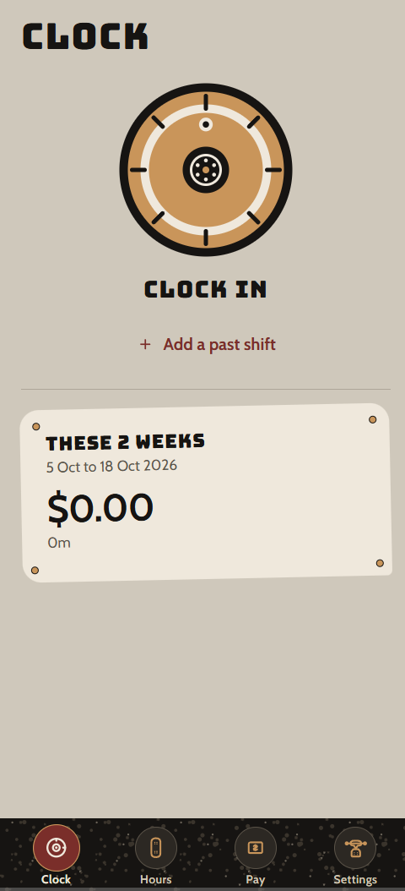

# Logit

A timesheet that lives on your iPhone home screen. Clock in, keep the hours, and see what a fortnight comes to after tax.

Skateboard graphics, griptape along the tab bar, and a wheel that keeps turning while you are clocked in.

**[Open Logit](https://finances-two-red.vercel.app)**



## What it does

- **Clock.** Tap in and out. The wheel spins while a shift is open, including the Clock tab, so a forgotten clock-out is easy to spot.
- **Hours.** Add or edit a past shift. Pick the date, and set the time down to the second. Mark a day as a public holiday.
- **Pay.** Fortnights, with gross, PAYG, super, and what you take home. Mark a fortnight paid when the money arrives.
- **Settings.** Hourly pay, weekend and night loadings, and a backup file. Hours stay in the browser on that phone.

## Run it

Needs Node.js 20+.

```bash
npm install
npm run web
```

```bash
npm test
```

## On a phone

```bash
npm run export:web
npx vercel --yes
```

Open the URL in Safari, then Share, Add to Home Screen. Save a backup from Settings now and then. Safari can forget website data if the app stays closed for a long time.
